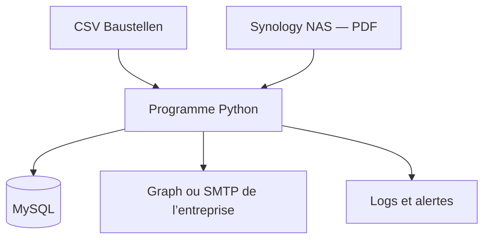

# Plan de travail — Envoi hebdomadaire des Prüfprotokolle

Version du 26 juillet 2026

## 1. But du projet

Créer un programme d'automatisation fiable, sans interface Web, qui :

1. importe les informations des Baustellen depuis un fichier CSV ;
2. les enregistre dans MySQL ;
3. cherche les nouveaux Prüfprotokolle PDF sur le Synology NAS ;
4. identifie l’Auftragsnummer ;
5. retrouve les bons destinataires ;
6. regroupe les nouveaux PDF par Auftrag ;
7. envoie un e-mail par Auftrag, une fois par semaine ;
8. empêche les doubles envois ;
9. garde un historique complet ;
10. permet de déclarer un protocole comme envoyé manuellement en cas d’urgence.

Le développement se fera d’abord à domicile avec des données fictives. L’installation réelle se fera ensuite sur le PC de l’entreprise, après un contrôle en lecture seule et avec l’accord de l’IT.

## 2. Décisions techniques retenues

### Architecture



- Python pour le programme.
- MySQL avec le moteur InnoDB pour la base de données.
- Synology NAS utilisé comme stockage de fichiers via SMB.
- Windows Task Scheduler pour lancer le programme sur le PC de l’entreprise.
- Fournisseur e-mail simulé à domicile.
- Microsoft Graph ou SMTP sécurisé dans l’entreprise, selon le service déjà disponible.
- Pas d’interface Web dans le MVP. Une CLI claire suffit pour importer, contrôler et dépanner.

Synology DSM prend en charge SMB2 et SMB3 chiffré pour le partage avec Windows : [documentation Synology](https://www.synology.com/en-global/dsm/feature/file_sharing).

### Règle hebdomadaire

Les Prüfprotokolle seront envoyés chaque semaine.

- Le scanner vérifie le NAS toutes les 10 minutes.
- Chaque nouveau PDF valide est préparé pour le prochain envoi.
- À l’heure hebdomadaire configurée, le programme crée un lot par Auftrag.
- Tous les nouveaux PDF de cet Auftrag sont joints au même e-mail.
- S’il n’y a aucun nouveau PDF, aucun e-mail client n’est envoyé.
- Un journal interne indique quand même que le contrôle a été exécuté.
- Si le PC, le NAS ou MySQL était indisponible à l’heure prévue, le programme reprend le lot en retard dès que le système fonctionne à nouveau.

Le jour et l’heure doivent rester configurables. Pour les tests HOME, on peut utiliser une valeur fictive comme vendredi à 15 h. La valeur réelle sera choisie dans l’entreprise.

Windows permet une tâche périodique en minutes ou une tâche hebdomadaire. Ici, la tâche Windows démarrera le programme toutes les 10 minutes et le programme décidera lui-même si un envoi est arrivé à échéance : [documentation `schtasks`](https://learn.microsoft.com/en-us/windows-server/administration/windows-commands/schtasks-create).

### Identification des PDF

Pour les futurs PDF, le nom doit contenir l’Auftragsnummer :

```text
126021_F0661_Pruefbericht_Beton_2026-06-25.pdf
```

Le format minimal accepté sera :

```text
126021_F0661.pdf
```

Le fichier réel `F0661.pdf` montre qu’un ancien scan peut ne pas contenir l’Auftragsnummer dans son nom. Il ne faut donc jamais l’envoyer automatiquement sur la base d’une supposition.

Ordre de confiance :

1. Auftragsnummer présente dans un nom conforme ;
2. table de correspondance contrôlée `Probe-Nr. → Auftragsnummer` ;
3. extraction du texte d’un PDF numérique ;
4. OCR seulement comme proposition à vérifier manuellement.

Un résultat OCR ne doit pas déclencher seul un envoi client.

### Fiabilité de l’envoi

- Le SHA-256 identifie le contenu du PDF.
- Le même contenu ne peut pas être envoyé deux fois automatiquement.
- Un PDF corrigé avec un nouveau contenu reçoit une nouvelle empreinte et devient une nouvelle version.
- Une contrainte unique dans MySQL protège contre les doublons.
- Un verrou empêche deux exécutions simultanées.
- Les statuts sont enregistrés avant et après chaque action.
- Un envoi urgent manuel doit être déclaré avec une commande du programme, en indiquant la personne, la date et le motif. Le PDF ne sera alors pas repris dans le lot hebdomadaire.

Microsoft Graph renvoie `202 Accepted` quand la demande d’envoi est acceptée, mais cela ne prouve pas la livraison au destinataire. La base distinguera donc `ACCEPTED` et `DELIVERED`, si une preuve de livraison est disponible : [documentation `sendMail`](https://learn.microsoft.com/en-us/graph/api/user-sendmail?view=graph-rest-1.0).

Pour Microsoft Graph, les pièces jointes entre 3 Mo et 150 Mo utilisent une session d’upload. La limite réelle de la messagerie de l’entreprise devra aussi être respectée : [documentation sur les pièces jointes volumineuses](https://learn.microsoft.com/en-us/graph/outlook-large-attachments).

## 3. Plan d’exécution complet

### Étape 1 — Verrouiller le périmètre du MVP

Durée : 1 à 2 jours.

Travail :

- écrire les règles métier dans `docs/REQUIREMENTS.md` ;
- fixer l’envoi hebdomadaire ;
- adopter un e-mail regroupé par Auftrag ;
- définir la règle de nommage des futurs PDF ;
- décider que les anciens scans ambigus vont en `MANUAL_REVIEW` ;
- définir l’objet et le corps de l’e-mail ;
- définir la taille maximale autorisée ;
- définir la règle pour une correction reçue après l’envoi de la semaine.

Résultat :

- cahier des charges court ;
- liste des questions encore dépendantes de l’IT ;
- critères d’acceptation écrits.

Condition de passage :

- aucune règle critique ne dépend d’une supposition cachée.

### Étape 2 — Créer le dépôt et la documentation durable

Durée : 1 jour.

Structure proposée :

```text
app/
  cli.py
  config.py
  database.py
  csv_import.py
  nas_scanner.py
  pdf_validator.py
  workflow.py
  mail/
sql/migrations/
tests/
sample_data/
config/
docs/
scripts/windows/
```

Créer aussi :

- `AGENTS.md` ;
- `docs/EXECUTION_PLAN.md` ;
- `docs/PROJECT_STATUS.md` ;
- `docs/DECISIONS.md` ;
- `.env.example` sans secret ;
- profils `home`, `test` et `company`.

Condition de passage :

- le projet peut être cloné et compris dans une nouvelle session sans l’historique du chat.

### Étape 3 — Préparer l’environnement HOME

Durée : 1 à 2 jours.

Travail :

- créer un environnement Python reproductible ;
- lancer MySQL localement ou avec Docker ;
- créer un faux NAS dans `sample_data/nas_mock` ;
- créer des CSV et PDF fictifs ;
- créer un fournisseur e-mail `mock` qui écrit les messages dans un dossier de test ;
- bloquer techniquement tout domaine client réel en mode HOME.

Condition de passage :

- une commande de contrôle confirme que Python, MySQL, le faux NAS et le mode mock fonctionnent ;
- aucun secret ni donnée réelle n’est présent.

### Étape 4 — Construire MySQL et les migrations

Durée : 2 à 3 jours.

Tables minimales :

- `baustelle` ;
- `auftrag` ;
- `empfaenger` ;
- `protokoll` ;
- `versand` ;
- `versand_protokoll` ;
- `csv_import` ;
- `audit_event`.

Améliorations importantes :

- `auftragsnummer` est un `VARCHAR`, jamais un entier ;
- les destinataires utilisés sont copiés dans un snapshot de l’envoi ;
- chaque envoi contient la période hebdomadaire concernée ;
- un envoi manuel est enregistré dans les mêmes tables que l’envoi automatique ;
- clés étrangères avec suppression interdite pour protéger l’historique ;
- index sur l’Auftragsnummer, le SHA-256, le statut et la prochaine tentative.

L’import CSV et les changements liés à un lot doivent utiliser des transactions. MySQL permet de confirmer avec `COMMIT` ou d’annuler avec `ROLLBACK` : [documentation MySQL](https://dev.mysql.com/doc/refman/8.4/en/commit.html).

Condition de passage :

- les migrations peuvent créer une base vide ;
- elles peuvent être relancées sans casser la base ;
- les contraintes bloquent les doublons.

### Étape 5 — Développer l’import CSV

Durée : 2 à 3 jours.

Fonctions :

- accepter UTF-8 et UTF-8 avec BOM ;
- nettoyer les espaces ;
- valider les champs obligatoires et les e-mails ;
- conserver les zéros au début de l’Auftragsnummer ;
- proposer `--dry-run` ;
- insérer ou mettre à jour ;
- ne rien supprimer automatiquement ;
- désactiver seulement avec `aktiv=0` ;
- produire un rapport avec le numéro de ligne ;
- appliquer tout l’import dans une seule transaction.

Condition de passage :

- importer deux fois le même CSV ne crée aucun doublon ;
- une ligne invalide ne modifie pas partiellement la base ;
- le rapport d’erreurs est compréhensible.

### Étape 6 — Développer le scanner NAS

Durée : 3 à 4 jours.

Fonctions :

- chercher seulement les `.pdf` ;
- ignorer les fichiers temporaires et vides ;
- vérifier que la taille est stable pendant deux scans ;
- vérifier la signature et la structure PDF ;
- calculer le SHA-256 ;
- enregistrer le chemin, la taille, la date et l’empreinte ;
- détecter le même contenu sous un autre nom ;
- continuer sans perte après un redémarrage.

Condition de passage :

- le même fichier scanné dix fois produit un seul enregistrement ;
- un fichier en cours de copie n’est pas traité ;
- un faux PDF renommé en `.pdf` est refusé.

### Étape 7 — Ajouter l’identification et la quarantaine

Durée : 2 à 3 jours.

Fonctions :

- analyser le nom du fichier ;
- rechercher l’Auftrag actif ;
- utiliser une correspondance contrôlée pour certains anciens scans ;
- classer en quarantaine : mauvais nom, Auftrag inconnu, PDF invalide ou résultat ambigu ;
- fournir une commande pour corriger manuellement l’association ;
- garder toutes les actions dans `audit_event`.

Condition de passage :

- aucun PDF ambigu ou inconnu ne peut atteindre le module d’e-mail.

### Étape 8 — Construire le moteur hebdomadaire

Durée : 3 à 4 jours.

États principaux :

```text
DISCOVERED → READY → SENDING → ACCEPTED
                  ↘ FAILED
                  ↘ MANUAL_REVIEW
DISCOVERED → QUARANTINED
READY → MANUALLY_SENT
```

Fonctions :

- sélectionner les PDF `READY` au moment hebdomadaire ;
- créer un lot par Auftrag ;
- enregistrer la période couverte ;
- figer les destinataires du lot ;
- bloquer un lot sans destinataire ;
- empêcher deux lots identiques ;
- reprendre un lot en retard après une panne ;
- appliquer des tentatives limitées avec attente progressive ;
- placer un timeout ambigu en `MANUAL_REVIEW` ;
- enregistrer un envoi urgent manuel.

Condition de passage :

- un crash à chaque étape peut être suivi d’une reprise sans double envoi.

### Étape 9 — Développer l’e-mail simulé

Durée : 2 jours.

Travail :

- créer l’objet et le corps du message ;
- joindre plusieurs PDF du même Auftrag ;
- afficher les destinataires réels prévus dans un rapport de test ;
- rediriger vers une adresse interne en mode test ;
- préfixer l’objet par `[TEST]` ;
- contrôler la taille totale ;
- enregistrer le message simulé sans appeler Internet.

Condition de passage :

- un utilisateur de l’entreprise peut relire un exemple complet et confirmer son contenu.

### Étape 10 — Connecter le vrai service e-mail

Durée : 3 à 5 jours, selon l’IT.

Ordre de choix :

1. service déjà utilisé et soutenu par l’entreprise ;
2. Microsoft Graph si Microsoft 365 est présent ;
3. relais SMTP sécurisé fourni par l’IT ;
4. Synology MailPlus seulement s’il est déjà administré ou explicitement choisi par l’IT.

Travail :

- créer un adaptateur Graph ou SMTP ;
- utiliser un compte technique à droits minimaux ;
- stocker les secrets hors de Git ;
- tester les petites et grandes pièces jointes ;
- traiter les erreurs certaines et les timeouts ambigus différemment.

Condition de passage :

- un e-mail de test arrive uniquement dans une boîte interne ;
- aucun client réel ne reçoit encore de message.

### Étape 11 — Ajouter les commandes d’exploitation

Durée : 2 jours.

Commandes recommandées :

```text
app healthcheck
app import-csv fichier.csv --dry-run
app import-csv fichier.csv
app scan
app run-due --dry-run
app run-due
app list-quarantine
app assign-protokoll
app mark-manually-sent
app retry-failed
```

Condition de passage :

- une personne formée peut contrôler et dépanner le système sans modifier directement MySQL.

### Étape 12 — Tests, sécurité et sauvegardes

Durée : 4 à 5 jours.

Tests obligatoires :

- même CSV importé plusieurs fois ;
- e-mail invalide ;
- Auftragsnummer avec zéro initial ;
- même PDF vu plusieurs fois ;
- même nom avec contenu corrigé ;
- PDF encore copié ;
- PDF invalide ;
- Auftrag inconnu ;
- destinataire manquant ;
- envoi manuel urgent ;
- NAS, MySQL ou messagerie indisponible ;
- timeout après demande d’envoi ;
- pièce jointe trop grande ;
- deux exécutions simultanées ;
- redémarrage au milieu d’un lot ;
- lot hebdomadaire en retard ;
- aucun nouveau PDF pendant la semaine.

Sécurité :

- compte MySQL, NAS et mail à droits minimaux ;
- logs sans secrets ;
- TLS pour MySQL si la connexion passe par le réseau ;
- rotation des logs ;
- sauvegarde quotidienne MySQL ;
- test réel de restauration ;
- règles DSGVO validées avec l’entreprise.

MySQL peut imposer les connexions chiffrées avec `require_secure_transport` : [documentation MySQL TLS](https://dev.mysql.com/doc/refman/8.4/en/using-encrypted-connections.html).

Condition de passage :

- tous les tests automatisés sont réussis ;
- une restauration de sauvegarde fonctionne dans une base de test ;
- les risques critiques ont une réponse documentée.

### Étape 13 — Préparer le transfert HOME vers COMPANY

Durée : 1 à 2 jours.

Créer un paquet sans :

- secrets ;
- fichiers `.env` réels ;
- données clients ;
- PDF réels ;
- logs ;
- sauvegardes MySQL.

Inclure :

- code versionné ;
- dépendances verrouillées ;
- migrations ;
- configuration d’exemple ;
- scripts PowerShell contrôlés ;
- guide d’installation ;
- guide de retour arrière ;
- somme de contrôle du paquet.

Condition de passage :

- le paquet est reproductible et peut être contrôlé avant son transfert par un moyen autorisé.

### Étape 14 — Faire l’audit en lecture sur le PC de l’entreprise

Durée : 1 jour.

Vérifier sans rien modifier :

- Windows, Python, PowerShell et MySQL ;
- modèle Synology et DSM ;
- chemin UNC du NAS ;
- droits SMB du compte technique ;
- service e-mail existant ;
- proxy, pare-feu, antivirus et accès Internet ;
- espace disque ;
- fuseau horaire et synchronisation de l’heure ;
- comportement du PC la nuit et le week-end ;
- sauvegardes existantes ;
- règles de l’IT et du Datenschutz.

Décision importante :

- si le PC est souvent arrêté ou en veille, il n’est pas un serveur fiable. Il faut alors utiliser un serveur Windows ou une VM disponible en permanence.

Condition de passage :

- rapport d’audit validé ;
- aucun blocage d’accès ;
- plan d’installation et de retour arrière approuvé.

### Étape 15 — Installer et tester dans l’entreprise

Durée : 2 à 3 jours.

Ordre :

1. sauvegarder l’état initial ;
2. installer le programme ;
3. créer la base et le compte MySQL dédié ;
4. configurer le NAS en lecture ;
5. configurer la messagerie ;
6. exécuter `healthcheck` ;
7. importer un CSV anonymisé ou de test ;
8. tester avec une copie des PDF ;
9. envoyer seulement vers une boîte interne ;
10. créer la tâche Windows toutes les 10 minutes avec blocage des exécutions simultanées.

Condition de passage :

- le système fonctionne plusieurs jours en `DRY_RUN` sans erreur importante.

### Étape 16 — Pilote sur deux cycles hebdomadaires

Durée : 2 semaines minimum.

Déroulement :

- semaine pilote 1 : 2 ou 3 Baustellen, destinataire interne ou contrôlé ;
- comparer chaque lot avec le processus manuel ;
- corriger les problèmes ;
- semaine pilote 2 : répéter avec les mêmes Baustellen ;
- confirmer que les PDF de la première semaine ne repartent pas ;
- tester un envoi urgent déclaré manuellement ;
- vérifier un rattrapage après une panne simulée.

Deux semaines sont nécessaires, car un système hebdomadaire doit prouver qu’il sait gérer au moins deux périodes consécutives.

Condition de passage :

- deux cycles réussis ;
- aucun double envoi ;
- accord du responsable métier et de l’IT.

### Étape 17 — Mise en production progressive

Durée : environ 1 semaine.

Déroulement :

1. activer un petit groupe de Baustellen ;
2. contrôler le premier lot ;
3. augmenter progressivement le nombre ;
4. surveiller erreurs, taille des pièces jointes et temps d’exécution ;
5. garder le retour arrière disponible ;
6. activer toutes les Baustellen seulement après stabilité.

Condition de passage :

- tous les Aufträge prévus sont actifs ;
- aucune anomalie critique reste ouverte.

### Étape 18 — Remise finale

Livrables :

- code et versions ;
- migrations MySQL ;
- modèle CSV ;
- tests et rapport de tests ;
- configuration d’exemple ;
- documentation d’installation et de désinstallation ;
- guide d’exploitation ;
- procédure de sauvegarde et de restauration ;
- procédure de quarantaine et d’envoi manuel ;
- procédure de retour arrière ;
- liste des comptes et droits, sans mots de passe ;
- formation courte d’un remplaçant ;
- procès-verbal de recette signé.

Le projet passe ensuite en maintenance : corrections, mises à jour de sécurité, contrôle des sauvegardes et revue périodique des logs.

## 4. Calendrier réaliste

| Semaine | Résultat principal |
|---|---|
| 1 | Exigences, architecture, dépôt et environnement HOME |
| 2 | MySQL, migrations et import CSV |
| 3 | Scanner NAS, validation PDF et quarantaine |
| 4 | Moteur hebdomadaire, anti-doublon et envoi manuel |
| 5 | E-mail mock, commandes et intégration Graph ou SMTP |
| 6 | Tests, sécurité, sauvegarde, documentation et paquet |
| 7 | Audit COMPANY, installation et tests internes |
| 8 | Dry-run et première semaine pilote |
| 9 | Deuxième cycle pilote |
| 10 | Production progressive et remise finale |

Ce calendrier suppose environ six semaines de développement puis quatre semaines de validation en entreprise. Les droits Microsoft 365, les accès au NAS ou les décisions de l’IT peuvent ajouter du délai.

## 5. Principaux risques et réponses

| Risque | Réponse prévue |
|---|---|
| Nom `F0661.pdf` sans Auftragsnummer | Nouvelle règle de nommage ; sinon mapping ou validation manuelle |
| Mauvaise lecture OCR | OCR non autorisé à envoyer seul |
| Double envoi après crash | SHA-256, contraintes uniques, états persistants et identifiant de corrélation |
| Envoi urgent repris le vendredi | Commande `mark-manually-sent` avec trace d’audit |
| PC éteint à l’heure prévue | Rattrapage automatique ; serveur ou VM si le PC n’est pas disponible en permanence |
| Mauvaise adresse dans le CSV | Validation et transaction complète |
| NAS indisponible | Aucun changement dangereux ; nouvelle tentative et alerte |
| Timeout e-mail ambigu | `MANUAL_REVIEW`, pas de renvoi aveugle |
| Pièces jointes trop grandes | Limite configurable, upload Graph adapté ou traitement manuel |
| Secrets dans Git | Fichiers d’exemple uniquement et stockage approuvé en entreprise |
| Sauvegarde inutilisable | Test de restauration obligatoire |

## 6. Définition de « projet terminé »

Le projet est terminé seulement si :

- les Prüfprotokolle partent une fois par semaine selon la configuration ;
- un e-mail regroupe les nouveaux PDF d’un même Auftrag ;
- le même PDF n’est jamais envoyé deux fois automatiquement ;
- un protocole envoyé manuellement n’est pas renvoyé ;
- un PDF ambigu ou lié à un Auftrag inconnu reste bloqué ;
- un CSV réimporté ne crée pas de doublon ;
- une panne ne fait pas perdre l’état ;
- les timeouts ambigus sont contrôlés manuellement ;
- les destinataires utilisés sont traçables ;
- deux cycles pilotes hebdomadaires ont réussi ;
- la sauvegarde MySQL a été restaurée avec succès ;
- l’IT possède les guides d’installation, d’exploitation et de retour arrière ;
- une autre personne peut reprendre le système sans dépendre de son développeur.

## 7. Première action concrète

Commencer par l’étape 1, puis créer immédiatement les quatre fichiers suivants :

1. `docs/REQUIREMENTS.md` ;
2. `docs/DECISIONS.md` ;
3. `docs/EXECUTION_PLAN.md` ;
4. `docs/PROJECT_STATUS.md`.

Ensuite seulement, préparer l’environnement HOME. Le code métier ne doit pas commencer avant que les règles sur le nom des PDF, le lot hebdomadaire et l’envoi manuel soient écrites noir sur blanc.
