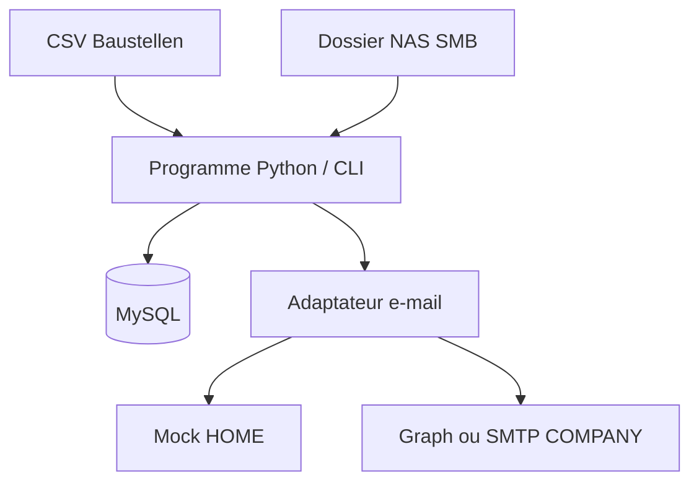
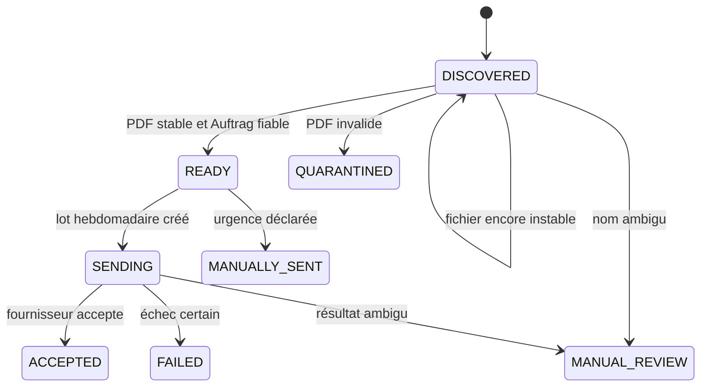

# Architecture du MVP

## Vue générale

Le programme est lancé périodiquement par Windows Task Scheduler. Il effectue
une petite unité de travail, enregistre son état puis se termine. Il n'a pas
besoin de rester ouvert ni d'avoir une interface.

## Modules

| Module | Responsabilité |
|---|---|
| `config` | Charger et valider le profil TOML. |
| `csv_records` | Lire et valider entièrement le CSV avant import. |
| `pdf_tools` | Vérifier le PDF, extraire l'Auftragsnummer et calculer le SHA-256. |
| `scanner` | Comparer deux observations et classer le fichier. |
| `database` | Ouvrir une connexion MySQL et exécuter les transactions. |
| `workflow` | Créer les lots hebdomadaires et gérer les états. |
| `mail` | Fournir `mock`, puis Graph ou SMTP. |
| `cli` | Exposer les commandes d'exploitation. |

## Flux cible

## Frontières de confiance

- Le CSV est une entrée non fiable jusqu'à validation complète.
- Le NAS est lu ; le programme ne modifie pas un PDF source.
- Le nom du PDF est fiable uniquement s'il respecte le format configuré.
- MySQL est la source de vérité pour l'état et l'anti-doublon.
- Le fournisseur e-mail peut accepter un message sans prouver sa livraison.
- En HOME, le fournisseur réel n'est pas chargé.

## Concurrence et reprise

- Une exécution doit obtenir un verrou MySQL nommé ou applicatif.
- Les transitions d'état importantes sont transactionnelles.
- Le lot et ses PDF sont enregistrés avant l'appel e-mail.
- Un retry réutilise le même lot et la même correlation ID.
- Un résultat dont l'acceptation est inconnue n'est jamais renvoyé
  automatiquement.

