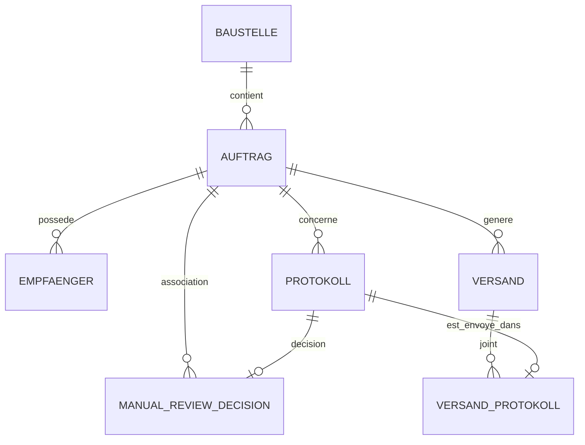

# Modèle de données MySQL

Les migrations de référence sont `sql/migrations/001_initial_schema.sql`,
`sql/migrations/002_scan_observation.sql` et
`sql/migrations/003_manual_review_decision.sql`.

| Table | Rôle |
|---|---|
| `baustelle` | Chantier et client. |
| `auftrag` | Auftragsnummer, Baustelle et activation. |
| `empfaenger` | Destinataires TO/CC d'un Auftrag. |
| `csv_import` | Rapport et empreinte de chaque import. |
| `protokoll` | Métadonnées, SHA-256, stabilité et état d'un PDF. |
| `scan_observation` | Dernière observation exacte par chemin NAS, dont le `mtime_ns` et le compteur de stabilité. |
| `manual_review_decision` | Décision humaine `ASSIGN` ou `IGNORE`, Auftrag éventuel, raison, acteur et date. |
| `versand` | Lot automatique ou envoi manuel, statut et snapshot. |
| `versand_protokoll` | PDF joints à un Versand. |
| `audit_event` | Événements de contrôle et changements sensibles. |
| `schema_migration` | Versions SQL appliquées. |

## Principes

- Identifiants techniques : `BIGINT UNSIGNED AUTO_INCREMENT`.
- Texte : `utf8mb4`.
- `auftragsnummer` : `VARCHAR(64)` avec index unique.
- SHA-256 : `CHAR(64)` et contrainte unique globale.
- Dates d'événements : `DATETIME(6)` en UTC.
- Suppression référentielle : `ON DELETE RESTRICT`.
- Les PDF restent sur le NAS.
- `scan_observation` porte l'état courant par chemin ; `protokoll` conserve
  l'identité globale du contenu par SHA-256.
- `empfaenger_snapshot` conserve les TO/CC utilisés lors du Versand.
- `dedupe_key` protège la création répétée d'un même lot.
- une décision MANUAL_REVIEW est unique par Prüfprotokoll et ne supprime jamais
  le PDF du NAS.

## Relation principale

